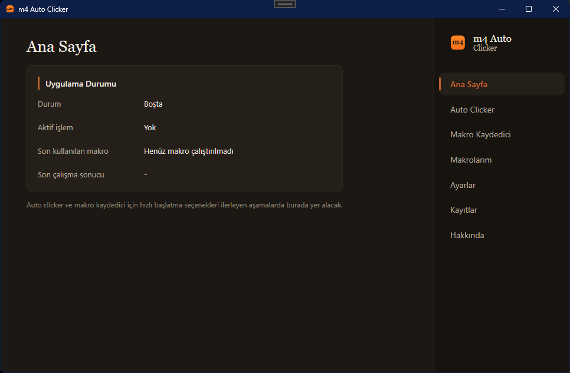
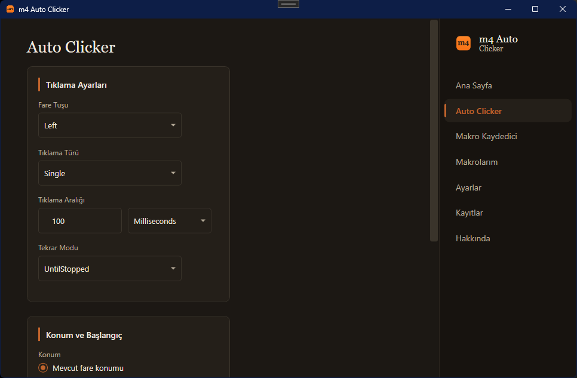
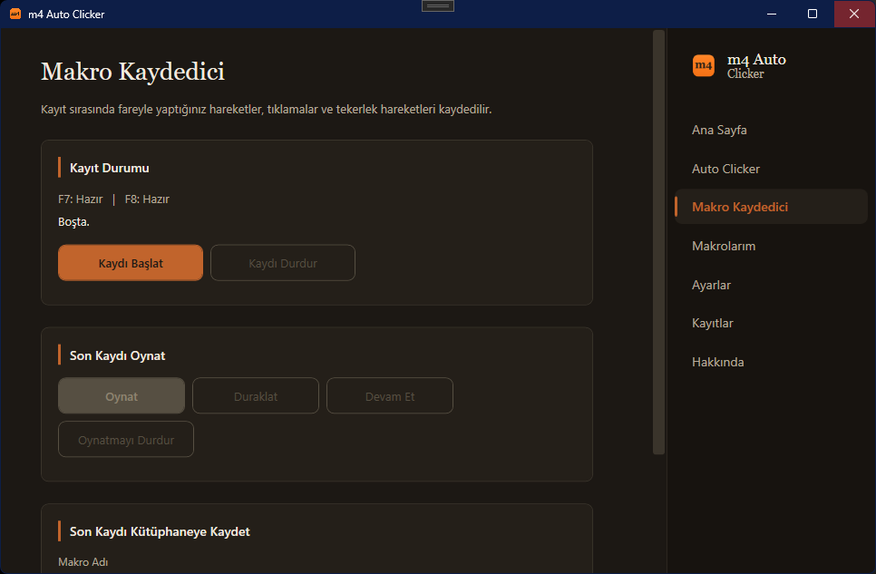
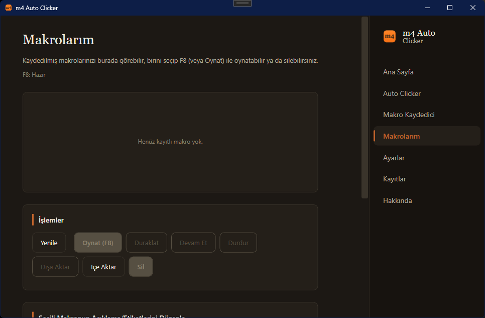
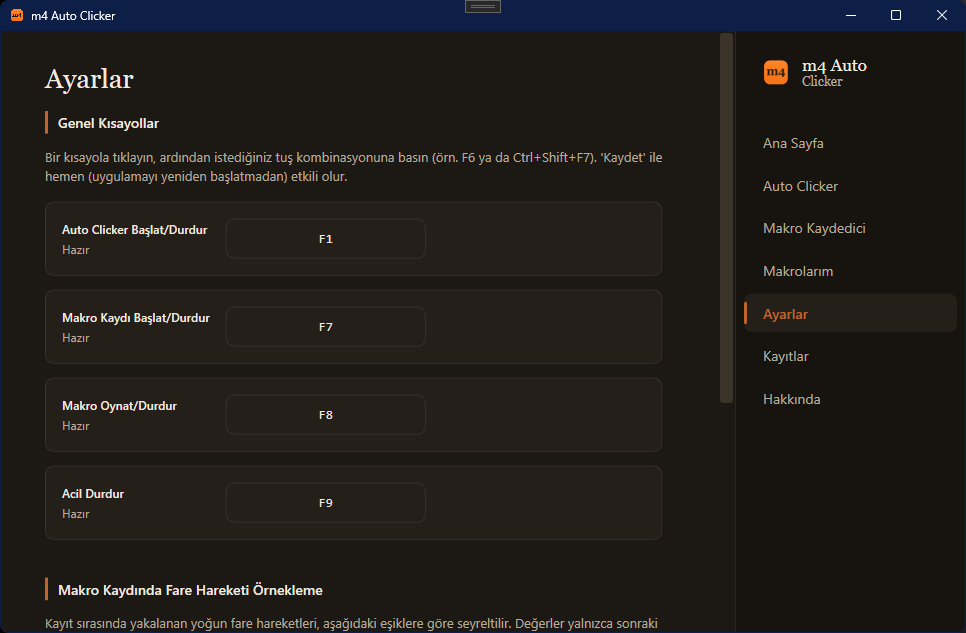
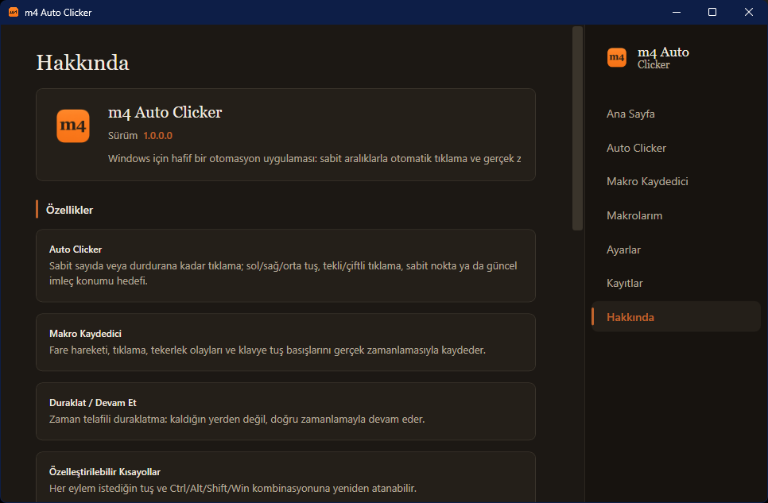

<div align="center">

# 🖱️ m4 Auto Clicker

**Windows için modern otomatik tıklama ve makro kayıt/oynatma uygulaması**

[](https://github.com/mer4t/mer4t-auto-clicker/releases/latest)
[](https://github.com/mer4t/mer4t-auto-clicker/actions/workflows/build.yml)
[](https://dotnet.microsoft.com/)
[](#)
[](#)
[](LICENSE)
[](#kaynak-koddan-çalıştırma)



</div>

---

## Nedir bu?

m4 Auto Clicker, tekrarlayan fare/klavye işlerini otomatikleştirmek için yazılmış hafif bir Windows masaüstü uygulaması. İki temel yeteneği var:

- **Auto Clicker** — belirlediğin aralıkta, belirlediğin noktada (veya güncel imleç konumunda) otomatik tıklama yapar.
- **Makro Kaydedici/Oynatıcı** — fare hareketlerini, tıklamaları, tekerlek olaylarını ve klavye tuş basışlarını gerçek zamanlamasıyla kaydeder; istediğin zaman aynı hızda veya farklı bir hızda tekrar oynatır.

Her şey global kısayollarla (varsayılan F6–F9, tamamen özelleştirilebilir) tek elden kontrol edilir; uygulama odakta olmasa bile çalışır.

**Güncel sürüm:** `v2.0.0` — sürüm geçmişi için [CHANGELOG.md](CHANGELOG.md) dosyasına bakabilirsiniz.

## ✨ Temel Özellikler

| | |
|---|---|
| 🎯 **Auto Clicker** | Sabit sayıda veya durdurana kadar tıklama, sol/sağ/orta tuş, tekli/çiftli tıklama, sabit nokta veya imleç konumu hedefi |
| 🎬 **Makro Kaydı** | Fare hareketi + tıklama + tekerlek **ve klavye tuş basışları** — gerçek zamanlamasıyla kaydedilir |
| ⏯️ **Duraklat / Devam Et** | Hem Auto Clicker hem makro oynatma sırasında, zaman telafili duraklatma (kaldığın yerden değil, doğru zamanlamayla devam eder) |
| ⌨️ **Özelleştirilebilir Kısayollar** | Her eylem, tuşlara basarak anında yakalanan bir kombinasyona (Ctrl/Alt/Shift/Win + tuş) yeniden atanabilir |
| 📂 **Makro Kütüphanesi** | Kaydedilen makroları listele, oynat, açıklama/etiket ekle, sil, dışa/içe aktar |
| 🖥️ **Ekran Uyuşmazlığı Uyarısı** | İçe aktarılan bir makro farklı ekran çözünürlüğünde kaydedilmişse oynatmadan önce uyarır |
| 🛑 **Acil Durdurma** | Tek kısayolla tüm aktif otomasyonları anında durdurur |
| 📋 **Log Ekranı** | Uygulama içinden son işlemleri izle; log dosyaları 14 günde bir otomatik temizlenir |
| 🔔 **Sistem Tepsisi** | Arka planda çalışır, tepsi simgesinden Göster / Acil Durdur / Çıkış |

### Auto Clicker

- Sol / sağ / orta fare tuşu, tekli veya çiftli tıklama.
- Tıklama aralığı milisaniye/saniye cinsinden ayarlanabilir.
- "Sabit sayıda tıkla" veya "durdurana kadar" tekrar modu.
- Hedef konum: güncel imleç konumu ya da ekranda sabitlenmiş bir nokta.

### Makro Kayıt ve Oynatma

- Fare hareketi, tıklama, tekerlek olayları ve klavye tuş basışları gerçek zamanlamasıyla kaydedilir.
- Kayıt sırasında yoğun fare hareketi örnekleri, ayarlanabilir mesafe/süre eşiklerine göre seyreltilerek optimize edilir.
- Oynatma sırasında duraklatma/devam etme, zaman telafili çalışır.
- Hata veya iptal durumunda basılı kalan fare tuşları otomatik bırakılır.

### Makro Kütüphanesi

- Kaydedilen tüm makrolar isim, açıklama ve etiketleriyle listelenir.
- Tek tıkla oynat/durdur/duraklat/devam et.
- `.json` olarak dışa aktarım ve başka bir makineden içe aktarım.
- İçe aktarılan bir makro, kayıt anındaki ekran çözünürlüğünden farklı bir ekranda oynatılacaksa uygulama önceden uyarır.

### Global Kısayollar

Varsayılan kısayollar `F6`–`F9`'dur, ancak **Ayarlar** ekranından her eylem için tuşlara basarak anında yeni bir kombinasyon atanabilir:

| Varsayılan | Eylem |
|---|---|
| `F6` | Auto Clicker'ı başlat/durdur |
| `F7` | Makro kaydını başlat/durdur |
| `F8` | Seçili makroyu oynat/durdur |
| `F9` | Acil durdurma — tüm aktif otomasyonları anında durdurur |

- Yeni bir kombinasyon başka bir eylemde zaten kullanılıyorsa kayıt reddedilir.
- Yeni kombinasyon işletim sistemi seviyesinde kaydedilemezse (başka bir uygulamayla çakışıyorsa) önceki çalışan kısayol otomatik olarak geri yüklenir; hiçbir eylem kısayolsuz kalmaz.
- Değişiklikler diske hemen kaydedilir ve uygulama yeniden başlatıldığında otomatik olarak yüklenir.

## 📸 Ekran Görüntüleri

<table>
<tr>
<td width="50%"></td>
<td width="50%"></td>
</tr>
<tr>
<td align="center"><sub>Auto Clicker</sub></td>
<td align="center"><sub>Makro Kaydedici</sub></td>
</tr>
<tr>
<td width="50%"></td>
<td width="50%"></td>
</tr>
<tr>
<td align="center"><sub>Makrolarım</sub></td>
<td align="center"><sub>Ayarlar — özelleştirilebilir kısayollar</sub></td>
</tr>
</table>

<div align="center">

<br><sub>Hakkında</sub>
</div>

## 🚀 Kurulum

### Portable ZIP kullanımı

1. [Releases](https://github.com/mer4t/mer4t-auto-clicker/releases/latest) sayfasından `m4AutoClicker-win-x64-portable.zip` dosyasını indirin.
2. İstediğiniz bir klasöre çıkartın (yönetici izni gerekmez).
3. `m4AutoClicker.App.exe` dosyasına çift tıklayın.

Bu paket **self-contained**'dır: ayrıca .NET Runtime kurmanıza gerek yoktur, tüm bağımlılıklar ZIP içindedir.

### Tek dosyalık EXE kullanımı

Aynı Releases sayfasında, tek başına çalışan `m4AutoClicker-win-x64-single.exe` dosyası da bulunur. Herhangi bir klasöre kopyalayıp doğrudan çalıştırabilirsiniz; ek dosya veya kurulum gerekmez.

> Uygulama dijital olarak imzalanmamıştır. İlk çalıştırmada Windows SmartScreen bir uyarı gösterebilir; "Ek bilgi" → "Yine de çalıştır" ile devam edebilirsiniz.

### Temel kullanım adımları

1. Uygulamayı açın; sistem tepsisine bir simge eklenir ve ana pencere görüntülenir.
2. **Auto Clicker** sekmesinden tıklama tuşu, türü, aralığı ve hedefi ayarlayıp `F6` (veya atadığınız kısayol) ile başlatın/durdurun.
3. **Makro Kaydedici** sekmesinden `F7` ile kayda başlayın, işlemlerinizi yapın, tekrar `F7` ile durdurun ve makroyu kütüphaneye kaydedin.
4. **Makrolarım** sekmesinden kaydedilen bir makroyu seçip `F8` ile oynatın.
5. Herhangi bir anda `F9` ile tüm otomasyonları acil olarak durdurabilirsiniz.
6. **Ayarlar** sekmesinden kısayolları kendi tercihinize göre yeniden atayabilirsiniz.

## 💻 Sistem Gereksinimleri

- Windows 10/11 (x64)
- Portable ZIP veya tek dosyalık EXE için ek bir gereksinim yoktur (self-contained, .NET Runtime kurulumu gerekmez)
- **Yönetici izni gerekmez** — uygulama standart kullanıcı izinleriyle çalışır (`app.manifest` içinde yükseltilmiş izin talebi yoktur)

## 🛠️ Kaynak Koddan Çalıştırma

### Gereksinimler

- Windows 10/11
- [.NET 10 SDK](https://dotnet.microsoft.com/download)

### Derleme ve çalıştırma

```bash
git clone https://github.com/mer4t/mer4t-auto-clicker.git
cd mer4t-auto-clicker
dotnet build m4AutoClicker.slnx
dotnet run --project src/m4AutoClicker.App
```

### Test

```bash
dotnet test m4AutoClicker.slnx
```

Uygulama, katmanların tamamını kapsayan **159 birim/entegrasyon testiyle** doğrulanmıştır.

### Release build oluşturma

```bash
dotnet publish src/m4AutoClicker.App/m4AutoClicker.App.csproj -c Release -r win-x64 --self-contained true -o release-artifacts/portable
```

Tek dosyalık EXE için aynı komuta `-p:PublishSingleFile=true -p:IncludeNativeLibrariesForSelfExtract=true` eklenir.

## 🧰 Kullanılan Teknolojiler

- **.NET 10** / **WPF** (`net10.0-windows10.0.19041.0`)
- **CommunityToolkit.Mvvm** — MVVM (ObservableObject, RelayCommand kaynak üreticileri)
- **Microsoft.Extensions.Hosting / DependencyInjection / Logging** — uygulama host'u ve bağımlılık enjeksiyonu
- **Microsoft.Windows.CsWin32** — Win32 API'lerine (RegisterHotKey, low-level mouse/keyboard hook, vb.) kaynak üretimli erişim
- **System.Text.Json** — ayar ve makro dosyalarının serileştirilmesi

## 🏗️ Gerçek Proje Klasör Yapısı

```
m4autoclicker/
├── src/
│   ├── m4AutoClicker.App/              # WPF uygulaması: View/ViewModel, tema, DI kurulumu
│   │   ├── Assets/                     # app.ico, logo.png
│   │   ├── Converters/
│   │   ├── DependencyInjection/
│   │   ├── Themes/                     # Colors.xaml, Dimensions.xaml, Styles.xaml
│   │   ├── ViewModels/Pages/
│   │   └── Views/Pages/
│   ├── m4AutoClicker.Application/      # Servisler, use-case'ler, arayüzler (platformdan bağımsız)
│   │   ├── Abstractions/
│   │   ├── Models/
│   │   └── Services/                   # AutoClickerService, MacroRecorder, MacroPlayer, HotkeyCoordinatorService, ...
│   ├── m4AutoClicker.Domain/            # Saf domain modelleri (Macro, HotkeyDefinition, ClickPlan, ...)
│   │   ├── Automation/
│   │   ├── Display/
│   │   ├── Hotkeys/
│   │   └── Macros/
│   ├── m4AutoClicker.Infrastructure/    # Dosya sistemi: JSON ayar/makro deposu, log dosyası okuma/yazma
│   │   ├── Logging/
│   │   └── Repositories/
│   └── m4AutoClicker.Platform.Windows/  # Win32 uygulamaları: RegisterHotKey, mouse/keyboard hook, tray icon
├── tests/                              # Her katman için ayrı test projesi (159 test)
├── screenshots/                        # README'de kullanılan ekran görüntüleri
└── release-artifacts/                  # Yerel publish çıktıları (git'e dahil değildir)
```

Proje, bağımlılıkların tek yönde aktığı katmanlı bir mimariyle yazılmıştır: `App` → `Application` → `Domain`, platforma özel kod ise `Platform.Windows` katmanında `Application` katmanındaki arayüzler üzerinden enjekte edilir.

## 📁 Ayar ve Log Dosyalarının Konumu

Uygulama, kullanıcıya özel verileri proje/kurulum klasörünün dışında, standart Windows kullanıcı verisi klasöründe tutar:

```
%LOCALAPPDATA%\m4 Auto Clicker\
├── settings.json     # Kısayol atamaları ve genel ayarlar
├── macros/           # Kaydedilen makrolar (.json)
└── logs/
    └── m4autoclicker-YYYY-MM-DD.log   # Günlük log dosyası, 14 günden eskiler otomatik silinir
```

## ⚠️ Bilinen Sınırlamalar

- Uygulama yalnızca Windows için geliştirilmiştir (WPF + Win32 API'lerine bağımlı); başka bir işletim sisteminde çalışmaz.
- Global kısayollar ve fare/klavye kancaları, bazı oyunların hile önleme (anti-cheat) sistemleriyle veya bazı kurumsal güvenlik yazılımlarıyla çakışabilir.
- Portable ZIP ve tek dosyalık EXE dijital olarak imzalanmamıştır; Windows SmartScreen ilk çalıştırmada uyarı gösterebilir.
- v1.0.0 sürümünde, ayarların diskten okunması sırasında oluşabilen bir zamanlama koşulu nedeniyle uygulamanın açılışta nadiren takılı kalabildiği tespit edilmiştir; bu sorun **v2.0.0** ile giderilmiştir.

## ⚖️ Sorumlu Kullanım Uyarısı

Bu uygulama; test, erişilebilirlik ve tekrarlayan görevleri otomatikleştirme gibi meşru amaçlarla kullanılmak üzere geliştirilmiştir. Otomatik tıklama ve makro işlevlerini, kullanım şartları otomasyona izin vermeyen oyunlarda veya hizmetlerde kullanmak, ilgili platformun kurallarını ihlal edebilir ve hesap yaptırımlarına yol açabilir. Uygulamayı yalnızca kendi sorumluluğunuzda ve ilgili hizmetlerin kullanım şartlarına uygun şekilde kullanın.

## 📜 Sürüm Geçmişi

Ayrıntılı sürüm notları için [CHANGELOG.md](CHANGELOG.md) dosyasına bakın. Öne çıkanlar:

- **v2.0.0** — Uygulama `m4 Auto Clicker` olarak yeniden adlandırıldı; tüm ekranlarda tutarlı, kart tabanlı yeni bir arayüz; kısayolları tuşlara basarak yakalama; kısayol çakışmasında önceki çalışan kısayola otomatik geri dönüş; açılışta nadiren yaşanan kilitlenmenin giderilmesi.
- **v1.0.0** — İlk kararlı sürüm (MertClicker adıyla): Auto Clicker, makro kayıt/oynatma, makro kütüphanesi, global kısayollar.

## 🤝 Katkıda Bulunma

Hata bildirimi veya öneri için lütfen bir [GitHub Issue](https://github.com/mer4t/mer4t-auto-clicker/issues) açın. Pull request göndermeden önce değişikliğinizi kısaca açıklayan bir issue oluşturmanız önerilir.

## 📄 Lisans

Bu proje [MIT Lisansı](LICENSE) ile lisanslanmıştır.
